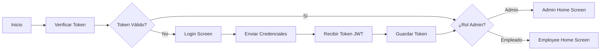

# Aplicación Móvil - Auxilio Mecánico

Aplicación móvil Flutter para la plataforma de Auxilio Mecánico, diseñada para permitir a administradores y empleados interactuar con el sistema desde sus dispositivos móviles.

## 📋 Características

### Pantalla de Login
- Autenticación con usuario y contraseña
- Conexión segura con el backend FastAPI
- Manejo de tokens JWT
- Almacenamiento seguro de credenciales

### Panel Administrador
- Visualización de lista de empleados
- Gestión rápida de cargos, roles y permisos
- Tarjetas de acceso rápido a funcionalidades principales
- Menú de opciones en el AppBar

### Panel Empleado
- Visualización de información personal
- Acceso a tareas y horario
- Notificaciones
- Tarjeta informativa del perfil

## 🗂️ Estructura de Carpetas

```
lib/
├── core/                    # Configuración y temas
│   ├── constants.dart      # Constantes de la app (URLs, claves, etc.)
│   └── theme.dart          # Tema visual personalizado
├── data/                    # Capa de datos
│   └── api_service.dart    # Servicio API para comunicarse con el backend
├── models/                  # Modelos de datos
│   └── user.dart           # Modelo de usuario/empleado
├── providers/               # State management con Provider
│   └── auth_provider.dart  # Proveedor de autenticación
├── screens/                 # Pantallas de la app
│   ├── auth/
│   │   └── login_screen.dart
│   ├── admin/
│   │   └── admin_home_screen.dart
│   └── employee/
│       └── employee_home_screen.dart
├── widgets/                 # Componentes reutilizables
│   ├── custom_app_bar.dart
│   └── custom_text_field.dart
└── main.dart               # Punto de entrada
```

## 🚀 Instalación y Configuración

### Requisitos Previos
- Flutter 3.8.1 o superior
- Android SDK (para emulador/dispositivo Android)
- Backend FastAPI corriendo en puerto 8001

### Pasos de Instalación

1. **Navegar a la carpeta mobile**
   ```bash
   cd mobile
   ```

2. **Instalar dependencias**
   ```bash
   flutter pub get
   ```
   analizar:
   flutter analyze
flutter pub upgrade record
3. **Configurar la URL del backend**
   - Editar `lib/core/constants.dart`
   - Cambiar `baseUrl` según tu entorno:
     - **Emulador Android**: `http://10.0.2.2:8001`
     - **Dispositivo físico**: `http://[tu-ip-local]:8001`
     - **iOS Simulator**: `http://localhost:8001`

4. **Ejecutar la aplicación**
   ```bash
   flutter run
   ```
   O con configuración específica:
   ```bash
   flutter run -d [device-id]
   ```

## 🔐 Configuración de Seguridad

### Almacenamiento de Tokens
- Los tokens JWT se almacenan en **Flutter Secure Storage**
- Se encriptan automáticamente según el dispositivo:
  - **Android**: Encrypted Shared Preferences
  - **iOS**: Keychain

### Claves de Almacenamiento
```dart
'auth_token'       // Token de acceso actual
'refresh_token'    // Token de refresco (si aplica)
'user_data'        // Datos del usuario
```

## 🔄 Flujo de Autenticación



## 📡 API Endpoints Utilizados

### Autenticación
- `POST /api/auth/login` - Inicia sesión
- `GET /api/auth/me` - Obtiene perfil del usuario actual
- `POST /api/auth/logout` - Cierra sesión

### Empleados
- `GET /api/empleados` - Lista todos los empleados (solo admin)
- `GET /api/empleados/{id}` - Obtiene detalles de un empleado
- `POST /api/empleados` - Crea un nuevo empleado (solo admin)
- `PUT /api/empleados/{id}` - Actualiza un empleado (solo admin)
- `DELETE /api/empleados/{id}` - Elimina un empleado (solo admin)

## 🎨 Tema Visual

La aplicación utiliza Material Design 3 con:
- **Color primario**: Azul (#2196F3)
- **Modo claro**: Optimizado para legibilidad
- **Componentes**: AppBar, Cards, Buttons, InputFields personalizados

## 👥 Roles y Permisos

### Admin
- Acceso a panel de administración
- Gestión de empleados, cargos, roles y permisos
- Visualización de todas las estadísticas

### Empleado
- Acceso a panel personal
- Visualización de tareas y horario
- Acceso a notificaciones

## 🛠️ Desarrollo Futuro

- [ ] Gestión completa de cargos (CRUD)
- [ ] Gestión de roles y permisos desde la app
- [ ] Notificaciones push
- [ ] Historial de actividades
- [ ] Exportación de reportes
- [ ] Modo offline
- [ ] Biometría

## 📝 Notas de Desarrollo

### Debugueo de la API
Para ver las request/response del API:
1. Abrir la consola de Flutter: `flutter run`
2. Presionar `v` para activar el DevTools
3. Ir a la pestaña Network

### Credenciales de Prueba
- **Usuario**: `admin` o `empleado` (según tu backend)
- **Contraseña**: `123`

## ❓ Solución de Problemas

### "No se puede conectar al servidor"
1. Verificar que el backend está corriendo en `8001`
2. Verificar la URL correcta en `constants.dart`
3. En Android, la IP debe ser `10.0.2.2` para emulador

### "Token inválido"
1. Limpiar almacenamiento: `flutter clean`
2. Reinstalar: `flutter pub get && flutter run`
3. Verificar que el token no ha expirado en el backend

## 📚 Referencias

- [Flutter Documentation](https://flutter.dev/docs)
- [Provider State Management](https://pub.dev/packages/provider)
- [HTTP Package](https://pub.dev/packages/http)
- [JWT Decode](https://pub.dev/packages/jwt_decode)

## 📄 Licencia

Todos los derechos reservados © 2026 Auxilio Mecánico
